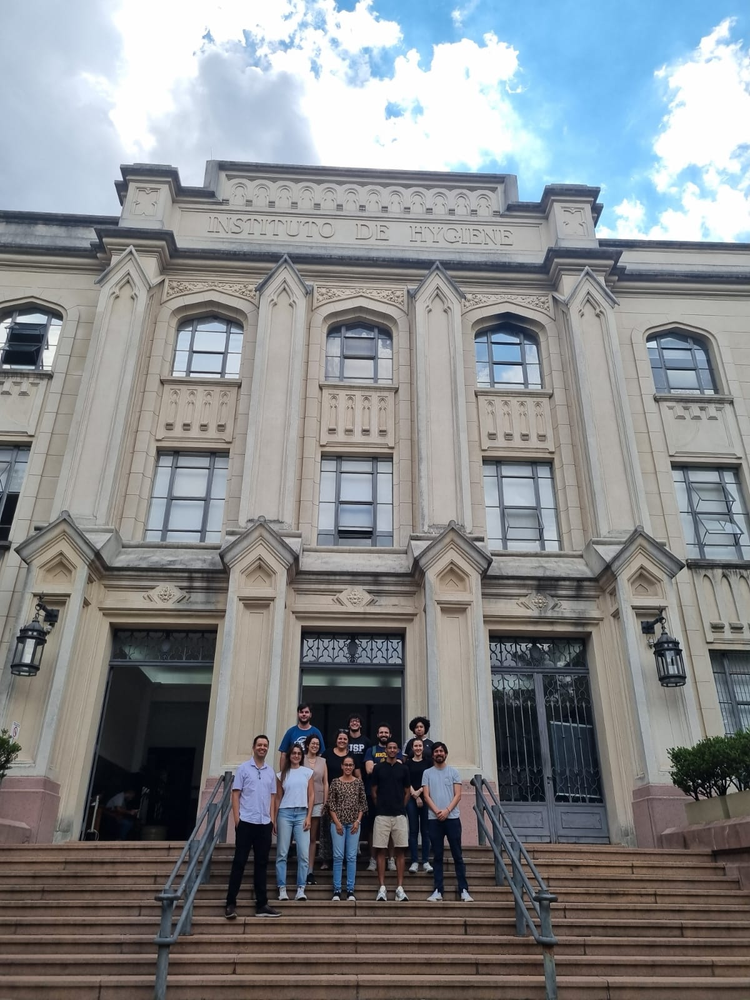

# Introdução à Linguagem de Programação em R para tratamento de dados de poluição do ar 2025

Material do curso [_Introdução à Linguagem de Programação em R para tratamento de dados da poluição do ar: o pacote openair_](https://www.fsp.usp.br/cverao/index.php/apresentacao.php).

O curso foi ministrado de 17 a 20 de fevereiro de 2025 oferecido como curso de verão pelo [LEHCA](https://www.fsp.usp.br/lehca/author/lehca/).

## Instruções

Para construir a apresentação você precisa instalar [`rmarkdown`](https://alexd106.github.io/intro2R/install_rmarkdown.html) e [`binb`](https://github.com/eddelbuettel/binb/tree/master?tab=readme-ov-file#usage).

```r
install.packages("rmarkdown")
install.packages("tinytext") # Para exportar em pdf
tinytext::install_tinytext() 
install.packages("binb") # Tema dos slides
```

## Conteudo

- `docs` tem as apresentações e códigos de cada aula.
- `scripts` tem os codigos _ao vivo_ durante as aulas e outros exemplos.
- `data` bases de dados e exemplos usados durante as aulas.

## A turma



## Temário

- Aula 1: R básico e data frames.
- Aula 2: Mais data frames e qualR.
- Aula 3: openair.
- Aula 4: Extras e estudo de casos.

## Professores

- Mario Gavidia-Calderón (mario.calderon@iag.usp.br)
- Rafaela Squizzato (rafaela.squizzato@iag.usp.br)
- Thiago Nogueira (thiagonogueira@usp.br)
